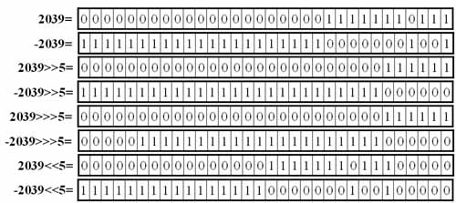

移位运算符操作的对象就是二进制的位，可以单独用移位运算符来处理int型整数

运算符	含义	例子
<<	左移运算符，将运算符左边的对象向左移动运算符右边指定的位数（在低位补0）	x<<3
>>	"有符号"右移运算 符，将运算符左边的对象向右移动运算符右边指定的位数。使用符号扩展机制，也就是说，如果值为正，则在高位补0，如果值为负，则在高位补1.	x>>3
>>>	"无符号"右移运算 符，将运算符左边的对象向右移动运算符右边指定的位数。采用0扩展机制，也就是说，无论值的正负，都在高位补0.	x>>>3

