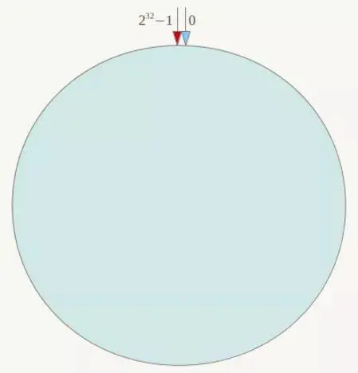
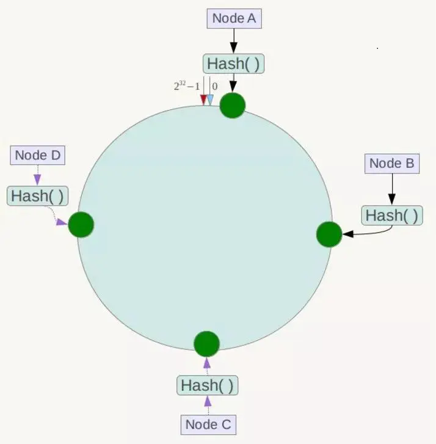
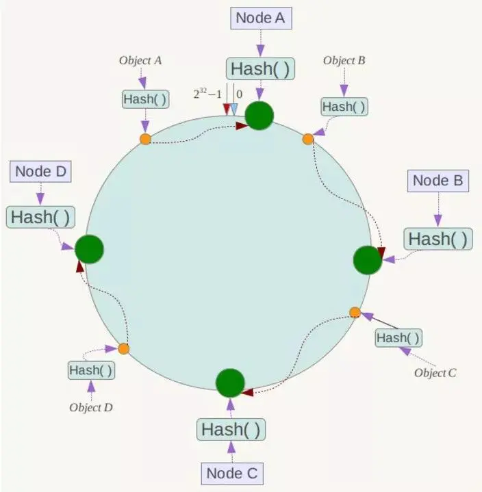
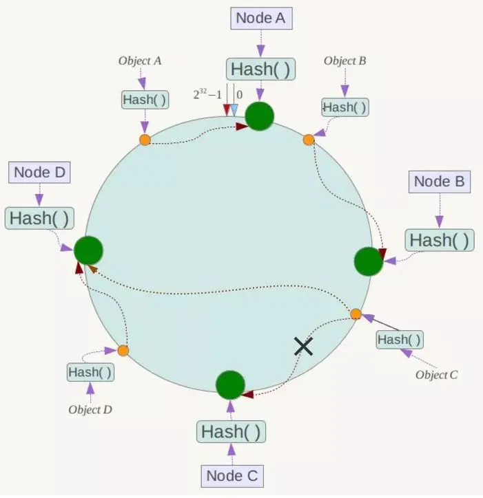
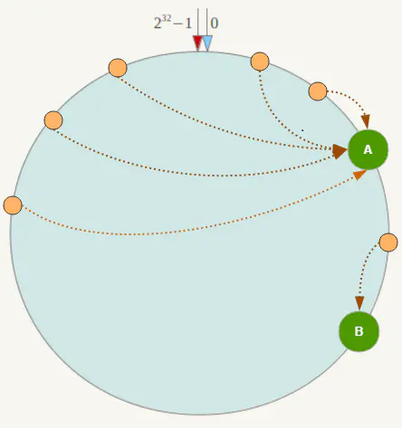

### hash算法（大量缓存重建）
### 一致性hash算法（自动缓存迁移）+虚拟节点（自动负载均衡）
### reids cluster的 hash slot算法


### 集群分片模式
如果Redis只用复制功能做主从，那么当数据量巨大的情况下，单机情况下可能已经承受不下一份数据，更不用说是主从都要各自保存一份完整的数据。在这种情况下，数据分片是一个非常好的解决办法。

Redis的Cluster正是用于解决该问题。它主要提供两个功能：

    自动对数据分片，落到各个节点上
    即使集群部分节点失效或者连接不上，依然可以继续处理命令
对于第二点，它的功能有点类似于Sentienl的故障转移，在这里不细说。下面详细了解下Redis的槽位分片原理，在此之前，先了解下分布式简单哈希算法和一致性哈希算法，以帮助理解槽位的作用。

### 简单哈希算法
假设有三台机，数据落在哪台机的算法为
```shell
c = Hash(key) % 3
```

例如key A的哈希值为4，4%3=1，则落在第二台机。Key ABC哈希值为11，11%3=2，则落在第三台机上。

利用这样的算法，假设现在数据量太大了，需要增加一台机器。A原本落在第二台上，现在根据算法4%4=0，落到了第一台机器上了，但是第一台机器上根本没有A的值。这样的算法会导致增加机器或减少机器的时候，引起大量的缓存击穿，造成雪崩。

缓存击穿：查询的数据在数据库中是存在，但是缓存中热点数据key恰巧失效，所有请求直接怼到数据库导致数据库连接等待甚至宕机

【加锁，双缓存[A,B]{A 缓存的key需要设置过期时间，而B缓存的key永不失效}】JUC （读写锁）

保证一致性： 在更新数据到数据库之后删除缓存在重新写入缓存。

缓存雪崩：查询的时候大面积的key集体失效导致请求直接到了数据库。（随机范围设置过期时间）

// select* from table where id = -1111 （坏人）

缓存穿透：查询的数据在数据库中不存在，也就意味没有命中缓存中key，导致请求全部到数据操作。（布隆过滤器，缓存空数据）

### 一致性哈希算法
在1997年，麻省理工学院的Karger等人提出了一致性哈希算法，为的就是解决分布式缓存的问题。

在一致性哈希算法中，整个哈希空间是一个虚拟圆环



假设有四个节点Node A、B、C、D，经过ip地址的哈希计算，它们的位置如下



有4个存储对象Object A、B、C、D，经过对Key的哈希计算后，它们的位置如下




对于各个Object，它所真正的存储位置是按顺时针找到的第一个存储节点。例如Object A顺时针找到的第一个节点是Node A，所以Node A负责存储Object A，Object B存储在Node B。

一致性哈希算法大概如此，那么它的容错性和扩展性如何呢？

假设Node C节点挂掉了，Object C的存储丢失，那么它顺时针找到的最新节点是Node D。也就是说Node C挂掉了，受影响仅仅包括Node B到Node C区间的数据，并且这些数据会转移到Node D进行存储。



同理，假设现在数据量大了，需要增加一台节点Node X。Node X的位置在Node B到Node C直接，那么受到影响的仅仅是Node B到Node X间的数据，它们要重新落到Node X上。

所以一致性哈希算法对于容错性和扩展性有非常好的支持。但一致性哈希算法也有一个严重的问题，就是数据倾斜。

如果在分片的集群中，节点太少，并且分布不均，一致性哈希算法就会出现部分节点数据太多，部分节点数据太少。也就是说无法控制节点存储数据的分配。如下图，大部分数据都在A上了，B的数据比较少。



### 哈希槽
Redis集群（Cluster）并没有选用上面一致性哈希，而是采用了哈希槽（SLOT）的这种概念。主要的原因就是上面所说的，一致性哈希算法对于数据分布、节点位置的控制并不是很友好。

首先哈希槽其实是两个概念，第一个是哈希算法。Redis Cluster的hash算法不是简单的hash()，而是crc16算法，一种校验算法。

另外一个就是槽位的概念，空间分配的规则。其实哈希槽的本质和一致性哈希算法非常相似，不同点就是对于哈希空间的定义。一致性哈希的空间是一个圆环，节点分布是基于圆环的，无法很好的控制数据分布。而Redis Cluster的槽位空间是自定义分配的，类似于Windows盘分区的概念。这种分区是可以自定义大小，自定义位置的。

Redis Cluster包含了16384个哈希槽，每个Key通过计算后都会落在具体一个槽位上，而这个槽位是属于哪个存储节点的，则由用户自己定义分配。例如机器硬盘小的，可以分配少一点槽位，硬盘大的可以分配多一点。如果节点硬盘都差不多则可以平均分配。所以哈希槽这种概念很好地解决了一致性哈希的弊端。

另外在容错性和扩展性上，表象与一致性哈希一样，都是对受影响的数据进行转移。而哈希槽本质上是对槽位的转移，把故障节点负责的槽位转移到其他正常的节点上。扩展节点也是一样，把其他节点上的槽位转移到新的节点上。

但一定要注意的是，对于槽位的转移和分派，Redis集群是不会自动进行的，而是需要人工配置的。所以Redis集群的高可用是依赖于节点的主从复制与主从间的自动故障转移。

### 集群选举原理分析
选举流程：
    
    原理分析：
    当slave发现自己的master变为FAIL状态时，便尝试进行Failover，以期成为新的master。由于挂掉的master可能会有多个slave，从而存在多个slave竞争成为master节点的过程， 其过程如下：
    1.slave发现自己的master变为FAIL
    2.将自己记录的集群currentEpoch加1，并广播FAILOVER_AUTH_REQUEST信息
    3.其他节点收到该信息，只有master响应，判断请求者的合法性，并发送FAILOVER_AUTH_ACK，对每一个epoch只发送一次ack
    4.尝试failover的slave收集FAILOVER_AUTH_ACK
    5.超过半数后变成新Master
    6.广播Pong通知其他集群节点。
    
    从节点并不是在主节点一进入 FAIL 状态就马上尝试发起选举，而是有一定延迟，一定的延迟确保我们等待FAIL状态在集群中传播，slave如果立即尝试选举，其它masters或许尚未意识到FAIL状态，可能会拒绝投票
    
    延迟计算公式：
    DELAY = 500ms + random(0 ~ 500ms) + SLAVE_RANK * 1000ms
    1
    SLAVE_RANK表示此slave已经从master复制数据的总量的rank。Rank越小代表已复制的数据越新。这种方式下，持有最新数据的slave将会首先发起选举（理论上）。
    
    补充之前的一个问题：
    
    跳转重定位
    当客户端向一个错误的节点发出了指令，该节点会发现指令的 key 所在的槽位并不归自己管理，这时它会向客户端发送一个特殊的跳转指令携带目标操作的节点地址，告诉客户端去连这个节点去获取数据。客户端收到指令后除了跳转到正确的节点上去操作，还会同步更新纠正本地的槽位映射表缓存，后续所有 key 将使用新的槽位映射表。